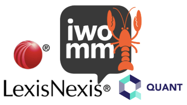
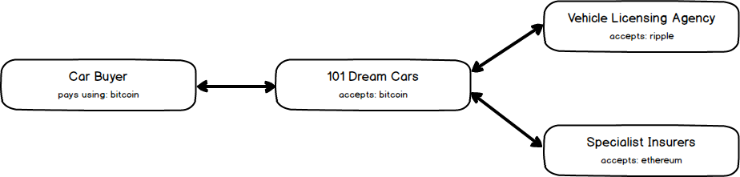

# IWOMM Developing on the Blockchain

> *Wednesday, 13th February 2019, 18:30 to 21:30, Lexis House, 30 Farringdon St, London*

<p align="center">
    
</p>

## Introduction

An introduction to exploring the blockchain using [Quant Network's](https://www.quant.network) Overledger SDK. Kindly sponsored by [101Ways](https://www.101ways.com/) and [LexisNexis](http://www.lexisnexis.co.uk/en-uk/home.page).

Quant's Overledger is a platform that facilitates the development of decentralised, multi-chain applications which allows you build on the blockchain more quickly and efficiently.

During the next 101 minutes we will build the skeleton of a multi-chain application backend for a distributed commerce application: **101 Dream Cars**.

## Running order

1. Short [presentation about Overledger](documents/quant-101ways-iwomm-presentation_20190213.pptx)
2. What you will be building **101 Dream Cars**
3. Setting up the environment
4. Application flow / outline

## 101 Dream Cars

<p align="center">
    
    
    
</p>

**101 Dream Cars** is a one stop shop for dCommerce of unique motor vehicles. It prides itself on facilitating a single transaction where a buyer can:

* Purchase a car with *101 Cars* using **Bitcoin**
* Register a car with the *Vehicle Licencing Agency* using **Ripple**
* Insure a car with *Specialist Insurers* using **Ethereum**

In order to do this it utilises an online shop where it transacts with the buyer, and integrates with third party services. The transactions are recorded immutable on the respective blockchains as used by each of the services.

> In order to keep this demonstration practical we will focus on the integration with the blockchain opposed to building a nice front-end.

## Setting up the environment

> This session will focus on a JavaScript application.

Only one dependency is required [@quantnetwork/overledger-sdk](https://www.npmjs.com/package/@quantnetwork/overledger-sdk):

```sh
# npm
npm install @quantnetwork/overledger-sdk

# yarn
yarn add @quantnetwork/overledger-sdk
```

Link to [Quant Overledger SDK JavaScript](https://github.com/quantnetwork/overledger-sdk-javascript) for some guidance and information.

### Additional environment setup

Please note that the package expect certain build tools already present. MacOS and Linux normally has these preinstalled like the xcode-select gcc compiler etc.

For windows it is important to add the following steps if that is not already configured for your environment.

> PLEASE NOTE: If you already have Python and Windows Build Tools installed this may not work for you. The steps below are dependent on a clean machine. They are tested with node 10.15.1 LTS

```sh
# From an administrative privileged command prompt
npm install --global --production windows-build-tools
npm install -g node-gyp
```

### Quant Developer Portal registration

> **PLEASE NOTE** To make best use of the time for this event we've disabled the checking for a MappId & BpiKey. As such you can choose your own version for those keys.

|attribute|suggestion|
|---|---|
|MappId|Unique identifier for the application, in this case the 101 Dream Cars shop. Suggest you use your email in reverse dot notation; i.e. `network.quant.dejong.jean-paul`|
|BpiKey|Specific key that can be updated an revoked by environment. You can use anything; i.e. `mybpikey`|

#### Optional at today's event
Sign up at the [Quant Developer Portal](https://developer.quant.network) is free, and it will provide ongoing access to our testnet. Deployment into a production environment will require a holding of our utility token **QNT**. Some of the key benefits of our testnet are;

* Instant access environment with all supported Distributed Ledger Technologies.
* Faucets to supply test value as required by your chosen DLTs.
* Requires only a single end-point to be made available through any corporate firewalls.

## Application Flow / Outline

The objective of the next 101 minutes is to get to a stage where through a single transaction your shops **101 Dream Cars** can not only take payment for the vehicle sold, but also performs the registration with the **Vehicle Licensing Agency** and pays for the insurance with **Specialists Insurers**

<p align="center">
    
</p>

### Key Information

|Organisation|DLT|Public address|
|---|---|---|
|Vehicle Licensing Agency|ripple|***TODO**: create XRP account*|
|Specialist Insurers|ethereum|***TODO:** create ETH account*|

### Setup the shop methods

* Create and store for the shop
  * Bitcoin account
  * Ripple account
  * Ethereum account
* Fund all addresses in the accounts through a faucet with some initial values
* Check balances on all three addresses

### Create the car buyer methods

* Create and store bitcoin account
* Fund bitcoin account
* Check balance of bitcoin account
* Buy a car :) Create/Sign/Send transaction
  * Transaction for X BTC to Shop BTC address with message "Car Make / Model"

### Continue shop methods

* Get transactions by Transaction ID
* Register and Insure Vehicle
* Create/Sign/Send multi-chain transaction
  * Vehicle License Agency (ripple) with message TransactionId & Vehicle Registration Number (VRN)
  * Specialist Insurers (ethereum) with  message TransactionId & Car / Make / Model
* Check balances
* Get transactions by MappId

